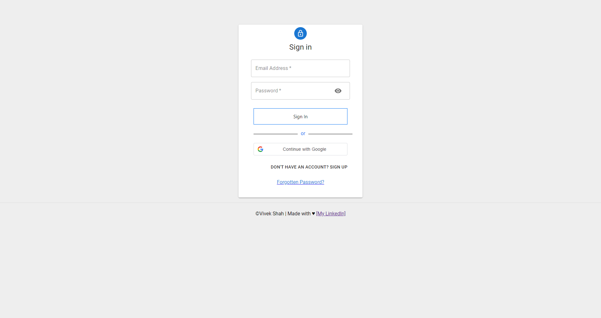

# Billing Website

## Introduction

This repository contains the information for a billing website built using the MERN stack. The website provides various billing app functionalities and includes a ledger functionality for managing financial records.

## Table of Contents

- [Features](#features)
- [Installation](#installation)
- [Usage](#usage)
- [Technologies](#technologies)
- [Authors](#authors)
- [Sneak-Peeks](#sneak-peeks)

## Features

The billing website offers the following functionalities:

- User authentication and authorization
- Customer management
- Product catalog management
- Invoice generation and management
- Payment tracking and reminders
- Ledger functionality for maintaining financial records
- Reporting and analytics

## Installation

To get the billing website for your own use, contact us at [Venv-Dev](mailto:venv.developers@gmail.com?subject=[GitHub]%20Billing%20Website%20Query).

## Usage

Once the billing website is up and running, you can perform the following actions:

- Register a new user account or log in with existing credentials.
- Manage customers:
  - Add new customers
  - Edit customer details
  - Delete customers
  - View customer information
- Manage products:
  - Add new products
  - Edit product details
  - Delete products
  - View product information
- Generate invoices for customers:
  - Select products
  - Set quantities
  - Apply discounts
  - Calculate totals
  - Save and send invoices
- Track payments:
  - Mark invoices as paid/partially paid/unpaid
  - Record payment details
  - View payment history
  - Send payment reminders
- Utilize ledger functionality:
  - Record income and expenses
  - Categorize transactions
  - Generate financial reports
  - Balance accounts
- Access reports and analytics:
  - View sales reports
  - Monitor customer trends
  - Analyze financial data

## Technologies

The billing website is built using the following technologies:

- MongoDB: NoSQL database for data storage
- Express.js: Backend web application framework
- React: JavaScript library for building user interfaces
- Node.js: JavaScript runtime environment

Additional libraries and dependencies:

- Redux: State management
- Axios: HTTP client for making API requests
- Bootstrap: CSS framework for responsive design
- Chart.js: Charting library for visualizing data
- and more...

## Authors

- [@Vivek](https://www.linkedin.com/in/the-cipher-vivek)
- [@Vraj](https://www.linkedin.com/in/vraj1103)

- [Want a website?](mailto:venv.developers@gmail.com?subject=[GitHub]%20Billing%20Website%20Query)

## Sneak-Peeks

### Login Page

### Dashboard

### Customers

### Customer Details

### Add Customer

### Invoices

### Record Payment

### Invoice Generation

### Invoice Preview

### Payment History

